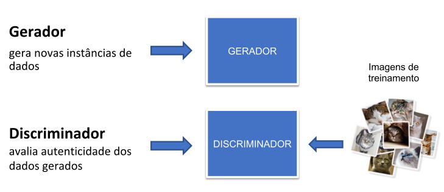
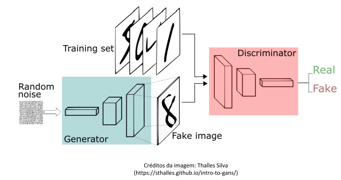

# GANs - Generative Adversarial Networks
Redes Adversárias Generativas

Introduzida por Ian Goodfellow e outros pesquisadores da Universidade de Montreal, em 2014

Rede neural que faz parte do conjunto de modelos generativos, sendo capazes de gerar conteúdos novos nunca antes gerados

Podem ser aplicadas desde imagens até em música, fala e escrita

Arquitetura composta por duas redes neurais: Gerador e Discriminador

São colocadas uma contra a outra (por isso “Adversárias”)

Paper original:

Generative Adversarial Networks
(https://arxiv.org/abs/1406.2661)

## Sobre o repositório
Neste repositório, apresentaremos uma coleção de notebooks Jupyter demonstrando diferentes aplicações de redes generativas adversariais (GANs). As GANs são uma classe poderosa de algoritmos de aprendizado de máquina que permitem a síntese artificial de dados realistas.

Ao longo dos notebooks, mostraremos como as GANs podem ser usadas para uma variedade de tarefas, incluindo:

Geração de imagens sintéticas
Produção de texto artificial
Criação de áudio simulado
Completion de dados incompletos
Melhoria da resolução de imagens
Transferência de estilo entre domínios
Em cada notebook, discutiremos os princípios por trás da abordagem específica, treinaremos modelos GAN em conjuntos de dados relevantes, e demonstraremos os resultados obtidos.

Esperamos que esta coleção sirva como um recurso útil para aqueles interessados em aprender mais sobre as muitas aplicações das GANs. Fique à vontade para nos contatar com quaisquer perguntas ou comentários!

## Tipos de GANs
* DCGANs (Deep Convolutional)
* WGANs (Wasserstein) 
* SRGANs (Super resolution)
* Pix2Pix (Image-to-image)
* CycleGAN (Cycle Generative) 
* StackGAN (Stacked GAN)
* ProGAN (Progressive Growing)
* Big GAN
* GFP GAN
* Face swap - GAN
* Autopipeline
* Stable Diffusion
* GAN Video
* GAN Audio
* Pixel Art

## Funcionamento básico

## Etapas
Gerador considera valores aleatórios para gerar uma imagem.

* A imagem gerada é inserida no Discriminador junto a um 
fluxo de imagens retiradas do conjunto de dados real 
(para ele ter como referência)
* O Discriminador retorna probabilidades da imagem 
gerada ser real. O resultado é um número entre 0 (falso) 
e 1 (autêntico)
